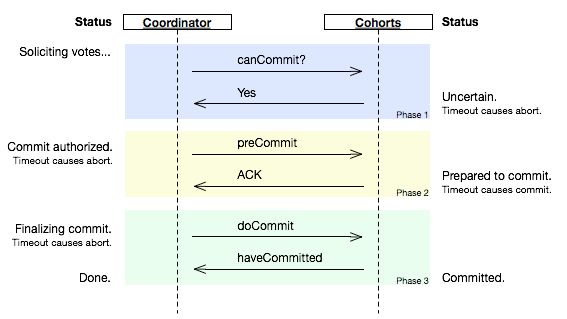

# 分布式事务
&emsp;&emsp;存储引擎的事务特性能够保证在存储引擎级别实现ACID，而分布式事务则让存储引擎级别的ACID可以扩展到数据库层面，甚至可以扩展到多个数据库之间。
### 标准分布式事务
- XA是由X/Open组织提出的分布式事务的规范。XA规范主要定义了（全局）事务管理器（TM）和（局部）资源管理器（RM）之间的接口。主流的关系型数据库产品都是实现了XA接口的。
- XA接口是双向的系统接口，在事务管理器（TM）以及一个或多个资源管理器（RM）之间形成通信桥梁。
- XA之所以需要引入事务管理器是因为，在分布式系统中，从理论上讲两台机器理论上无法达成一致的状态，需要引入一个单点进行协调。
- 由全局事务管理器管理和协调的事务，可以跨越多个资源（如数据库或JMS队列）和进程。全局事务管理器一般使用XA二阶段提交协议与数据库进行交互。
### 两阶段提交（Two Phase Commit） -- 2PC
&emsp;&emsp;2PC将事务的提交过程分为准备阶段和提交阶段。事务的发起者称协调者，事务的执行者称参与者。
#### 阶段1：准备阶段
- 1.协调者向所有参与者发送事务内容，询问是否可以提交事务，并等待所有参与者答复。
- 2.各参与者执行事务操作，但不提交事务。
- 3.如参与者执行成功，给协调者反馈YES，即可以提价；如执行失败，给协调者反馈NO，即不可以提交。
#### 阶段2：提交阶段
- 此阶段分两种情况。所有参与者均反馈YES时，即提交事务；任何一个参与者反馈NO时，即中断事务。
### 三阶段提交协议 -- 3PC（对2PC优化）
&emsp;&emsp;3PC，三阶段提交协议，是对2PC的改进版本。即事务的提交过程分为CanCommit、PreCommit、DoCommit三个阶段来进行处理。
 
#### 阶段1：CanCommit
- 1.协调者向参与者发出CanCommit请求，询问是否可以提交事务，并等待所有参与者答复。
- 2.参与者收到CanCommit请求后，如果认为可以执行事务操作，则反馈YES，否则反馈NO。
#### 阶段2：PreCommit
- 1.所有参与者均反馈YES，即执行事务预提交。
- 2.任何一个参与者反馈NO，或者等待超时后协调者尚无法收到所有参与者的反馈，即中断事务。
#### 阶段3：DoCommit
- 1.所有参与者均反馈Ack响应，即执行真正的事务提交。
- 2.任何一个参与者反馈NO，或者等待超时后协调者尚无法收到所有参与者的反馈，即中断事务。