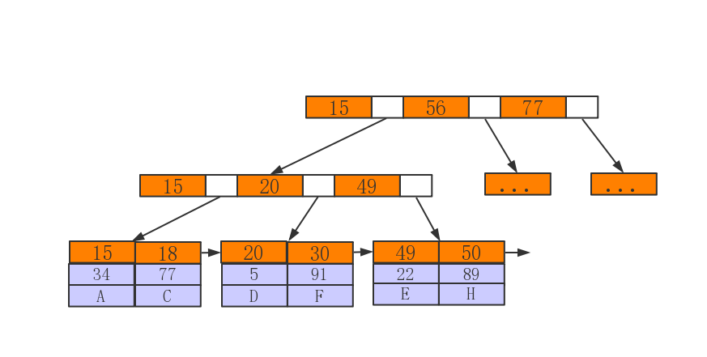

# InnoDB索引实现
&emsp;&emsp;在InnoDB中，表数据文件本身就是按B+Tree组织的一个索引结构，这棵树的叶节点data域保存了完整的数据记录。这个索引的key是数据表的主键，因此InnoDB表数据文件本身就是主索引。下图是InnoDB**主键索引**的原理图：

&emsp;&emsp;可以看到叶节点包含了完整的数据记录。这种索引叫做**聚集索引**。因为InnoDB的数据文件本身要按主键聚集，所以InnoDB要求表必须有主键（MyISAM可以没有），如果没有显式指定，则MySQL系统会自动选择一个可以唯一标识数据记录的列作为主键，如果不存在这种列，则MySQL自动为InnoDB表生成一个隐含字段作为主键，这个字段长度为6个字节，类型为长整形。  
&emsp;&emsp;InnoDB 表是基于聚簇索引建立的。因此InnoDB 的索引能提供一种非常快速的主键查找性能。不过，它的辅助索引（Secondary Index， 也就是**非主键索引**）也会包含主键列，所以，如果主键定义的比较大，其他索引也将很大。如果想在表上定义 、很多索引，则争取尽量把主键定义得小一些。InnoDB 不会压缩索引。
  文字符的ASCII码作为比较准则。聚集索引这种实现方式使得按主键的搜索十分高效，但是**辅助索引搜索需要检索两遍索引：首先检索辅助索引获得主键，然后用主键到主索引中检索获得记录。（回表）**  
#### InnoDB索引和MyISAM索引的区别：
- 一是主索引的区别，InnoDB的数据文件本身就是索引文件。而MyISAM的索引和数据是分开的。
- 二是辅助索引的区别：InnoDB的辅助索引data域存储相应记录主键的值而不是地址。而MyISAM的辅助索引和主索引没有多大区别。
