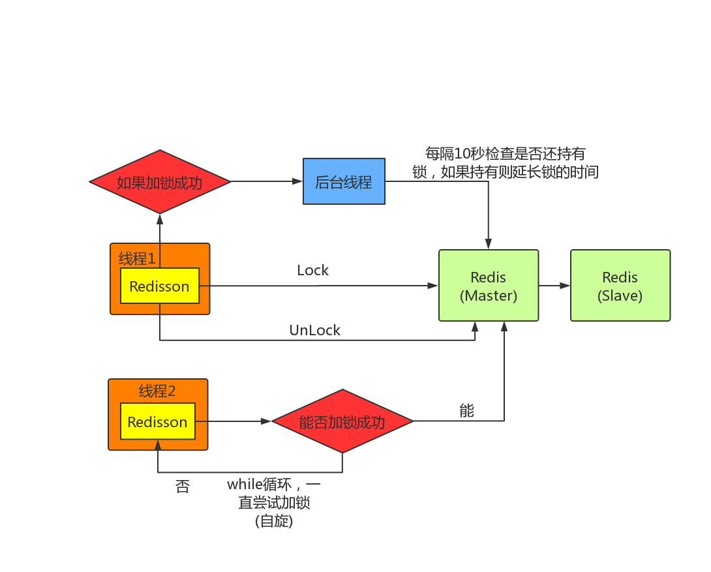

# Redis分布式锁
#### &emsp;&emsp;分布式锁场景：在分布式环境下，多个操作需要以原子的方式执行
## 一、基于<u><font color=red>SETNX</font></u>命令实现分布式锁
```
SETNX key value
  将 key 的值设为 value ，当且仅当 key 不存在。
  若给定的 key 已经存在，则 SETNX 不做任何动作。
  SETNX 是『SET if Not eXists』(如果不存在，则 SET)的简写。
返回值：
  设置成功，返回 1 。
  设置失败，返回 0 。
```
#### 使用SETNX完成同步锁的流程及事项如下：
- 使用SETNX命令获取锁，若返回0（key已存在，锁已存在）则获取失败，反之获取成功。
- 为了防止获取锁后程序出现异常，导致其他线程/进程调用SETNX命令总是返回0而进入死锁状态，**需要为该key设置一个“合理”的过期时间。**
- 释放锁，使用<u><font color=red>DEL</font></u>命令将锁数据删除。
## 二、Redisson分布式锁原理
