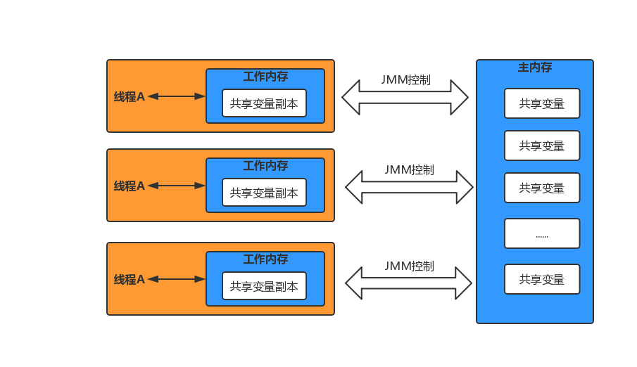
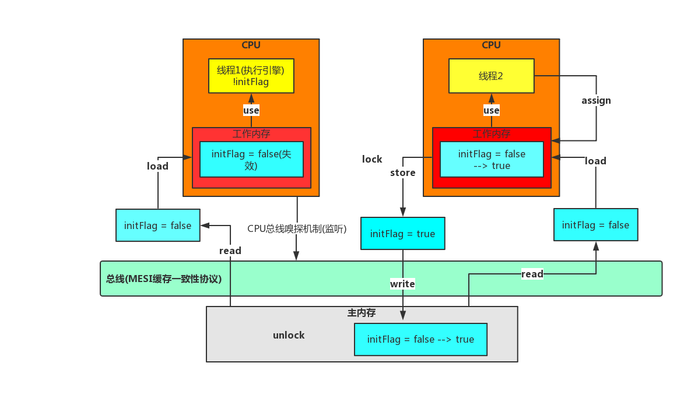

# Java内存模型
<br>
### JMM缓存不一致问题
- 总线加锁（性能太低）  
&emsp;&emsp;CPU从主内存读取数据到高速缓存，会在总线对这个数据加锁，这样其它CPU没法去读或写这个数据，直到这个CPU使用完数据释放锁之后其它CPU才能读取该数据。
- MESI缓存一致性协议  
&emsp;&emsp;多个CPU从主内存读取同一个数据到各自的高速缓存，当某个CPU修改了缓存里的数据，该数据会马上同步回主内存，其它CPU通过**总线嗅探机制**可以感知到数据的变化从而将自己缓存里的数据失效。
### Volatile可见性底层实现原理
&emsp;&emsp;底层实现主要是通过汇编lock前缀指令，它会锁定这块内存区域的缓存（缓存行锁定）并回写到主内存
- 1.会将当前处理器缓存行的数据立即写回到系统内存
- 2.这个写回内存的操作会引起在其它CPU里缓存了该内存地址的数据无效（MESI协议）

### JMM数据原子操作
```
read（读取）：从主内存读取数据
load（载入）：将主内存读取到的数据写入工作内存
use（使用）：从工作内存读取数据来计算
assign（赋值）：将计算好的值重新赋值到工作内存中
store（存储）：将工作内存数据写入主内存
write（写入）：将store过去的变量赋值给主内存中的变量
lock（锁定）：将主内存变量加锁，标识为线程独占状态
unlock（解锁）：将主内存变量解锁，解锁后其他线程可以锁定该变量
```
### 并发编程三大特性：可见性、原子性、有序性
&emsp;&emsp;volatile保证可见性与有序性，但是不保证原子性，保证原子性需要借助synchronized这样的锁机制