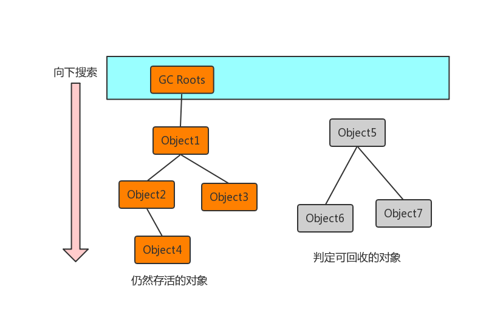

# JVM内存模型

#### 栈
&emsp;&emsp;为线程私有，栈描述的是Java方法执行的内存模型。每个方法被执行的时候都会创建一个栈帧用于存储局部变量表，操作数栈，动态链接，方法出口等信息。每一个方法被调用的过程就对应一个栈帧在虚拟机栈中从入栈到出栈的过程。
#### 程序计数器
&emsp;&emsp;程序计数器是一块很小的内存空间，它是线程私有的，可以认作为当前线程的行号指示器。这块内存区域是虚拟机规范中唯一没有OutOfMemoryError的区域。
#### 判断对象是否存活算法
##### 可达性分析算法
&emsp;&emsp;它的基本思路是通过一个称为“GC Roots”的对象为起始点，搜索所经过的路径称为引用链，当一个对象到GC Roots没有任何引用跟它连接则证明对象是不可用的。
 
&emsp;&emsp;若干个GC Roots作为起始点，从这个节点向下搜索，搜索所经过的路径称为引用链。当一个对象到GC Roots没有任何引用链，则可判定为可回收对象。
##### 可作为GC Roots的对象有四种
- 虚拟机栈(栈桢中的本地变量表)中的引用的对象，就是平时所指的java对象，存放在堆中。
- 方法区中的类静态属性引用的对象，一般指被static修饰引用的对象，加载类的时候就加载到内存中。
- 方法区中的常量引用的对象。
- 本地方法栈中JNI（native方法)引用的对象。